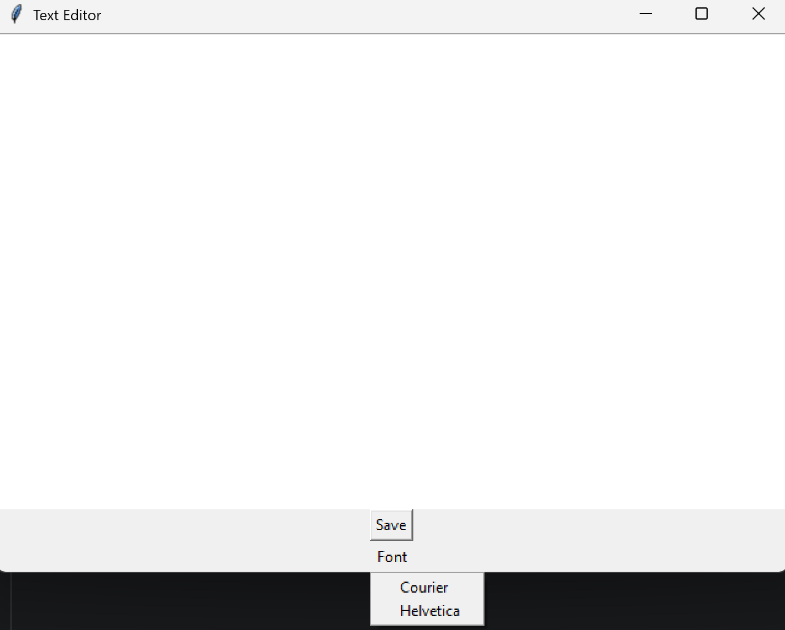
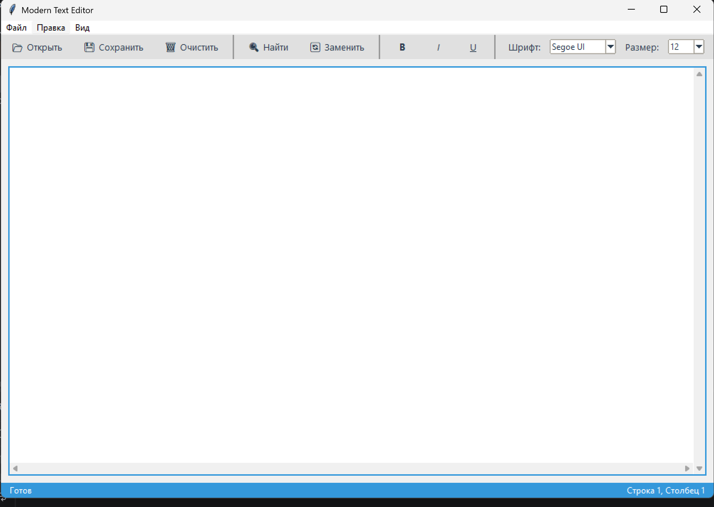
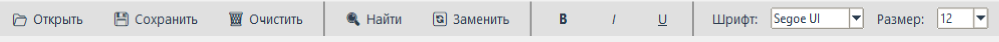
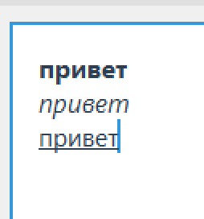
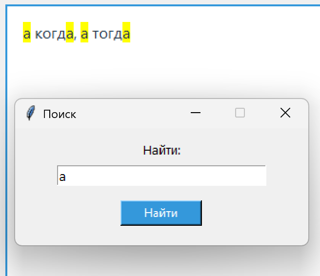
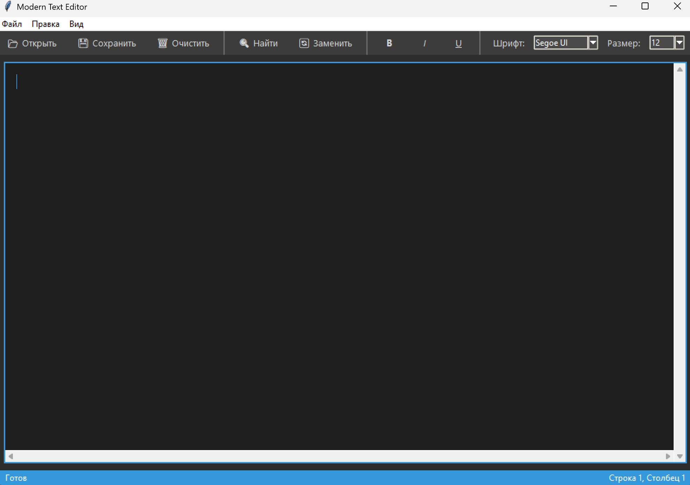

# Техническое руководство: создание текстового редактора на Python

## Введение

В этом руководстве описан полный путь создания текстового редактора на Python: от простейшего приложения по базовому туториалу - до модифицированной версии с современным интерфейсом, тёмной темой, форматированием текста и поиском.

**Источник базового туториала:**  [Create a Simple Python Text Editor!](https://www.instructables.com/Create-a-Simple-Python-Text-Editor/)

**Требования:**
- Python 3.6 или выше
- Tkinter (входит в стандартную поставку Python, отдельная установка не нужна)

---

## Часть 1. Исследование предметной области

### 1.1 Как работает GUI в Python?

Tkinter - стандартная библиотека Python для создания оконных приложений. Она является обёрткой над библиотекой Tk и не требует отдельной установки.

Главные понятия:
- **Root** - главное окно приложения, создаётся командой `tk.Tk()`.
- **Widget** - элемент интерфейса: кнопка (`Button`), поле ввода (`Text`, `Entry`), меню (`Menu`) и т.д.
- **Pack / Grid / Place** - менеджеры расположения виджетов в окне.
- **Event** - событие (нажатие клавиши, клик мышью).
- **Bind** - привязка события к функции-обработчику.

### 1.2 Ключевой виджет: tk.Text

В основе любого текстового редактора лежит виджет `tk.Text`. Он умеет:
- хранить многострочный текст и давать доступ к нему через индексы вида `"строка.символ"` (например, `"1.0"` - строка 1, символ 0 - это самое начало);
- подсвечивать фрагменты через теги(именованные стили);
- поддерживать отмену/повтор (`undo=True`);
- работать со скроллбарами.

---

## Часть 2. Базовая реализация по туториалу

Для знакомства с Tkinter воспроизведён простой редактор из базового руководства. Он состоит из 4 шагов.



### Шаг 1. Создаём окно

```python
import tkinter as tk

root = tk.Tk()
root.title("Text Editor")
root.geometry("600x400")
root.mainloop()
```

Запускаем: `python texteditor.py` - появляется пустое окно. `mainloop()` держит его открытым и обрабатывает события.

### Шаг 2. Добавляем текстовое поле

```python
import tkinter as tk

root = tk.Tk()
root.title("Text Editor")

text = tk.Text(root)
text.grid()

root.mainloop()
```

Теперь в окне большое текстовое поле - в него можно печатать.

### Шаг 3. Добавляем сохранение файла

```python
import tkinter as tk
from tkinter import filedialog

root = tk.Tk()
root.title("Text Editor")

text = tk.Text(root)
text.grid()

def save_as():
    t = text.get("1.0", "end-1c")
    save_location = filedialog.asksaveasfilename()
    with open(save_location, "w+") as f:
        f.write(t)

button = tk.Button(root, text="Save", command=save_as)
button.grid()

root.mainloop()
```

`filedialog.asksaveasfilename()` открывает стандартный диалог сохранения файла. `text.get("1.0", "end-1c")` считывает весь текст от начала до последнего символа (без финального переноса строки).

### Шаг 4. Добавляем смену шрифта

```python
def font_helvetica():
    text.config(font="Helvetica")

def font_courier():
    text.config(font="Courier")

font_btn = tk.Menubutton(root, text="Font")
font_btn.grid()
font_btn.menu = tk.Menu(font_btn, tearoff=0)
font_btn["menu"] = font_btn.menu

font_btn.menu.add_command(label="Courier",   command=font_courier)
font_btn.menu.add_command(label="Helvetica", command=font_helvetica)
```

### Что умеет базовый редактор?

| Функция | Есть? |
|---------|-------|
| Текстовое поле | ✅ |
| Сохранение файла | ✅ |
| Смена шрифта (2 варианта, весь текст) | ✅ |
| Открытие файла | ❌ |
| Форматирование (жирный, курсив) | ❌ |
| Поиск и замена | ❌ |
| Тёмная тема | ❌ |
| Горячие клавиши | ❌ |
| Строка состояния | ❌ |

Базовый редактор работает, но очень ограничен. На его основе создана значительно улучшенная версия.

---

## Часть 3. Модификация: современный текстовый редактор

После изучения базового туториала редактор переработан с нуля в виде класса. Ниже - полный путь от пустого файла до готового приложения.



### 3.1 Архитектура: переход к классу

Базовый туториал написан в процедурном стиле - весь код в глобальной области, функции используют `global`. Наша версия оформлена как класс `ModernTextEditor`: все виджеты и данные хранятся в атрибутах (`self.text`, `self.dark_mode` и т.д.), а функции становятся методами.

```
ModernTextEditor
│
├── __init__()            - создаёт окно, задаёт атрибуты, вызывает все setup-методы
├── setup_colors()        - цветовые константы для двух тем и акцентный цвет
│
├── create_menu_bar()     - меню «Файл / Правка / Вид»
├── create_toolbar()      - панель кнопок, разделители, выпадающие списки, кнопка темы
├── create_btn()          - вспомогательный метод: создать одну кнопку в toolbar
├── create_text_area()    - tk.Text со скроллбарами и предустановленными тегами
├── create_status_bar()   - нижняя строка: статус слева, курсор справа
│
├── update_cursor()       - обновляет «Строка N, Столбец N» по событию
├── update_status()       - показывает сообщение 2 сек, затем сбрасывает в «Готов»
│
├── make_bold()           - применяет/снимает тег "bold"
├── make_italic()         - применяет/снимает тег "italic"
├── make_underline()      - применяет/снимает тег "underline"
├── apply_format()        - toggle-логика для любого тега форматирования
├── change_font()         - меняет шрифт/размер для выделения или всего поля
│
├── open_file()           - диалог открытия, чтение в UTF-8
├── save_file()           - диалог сохранения с расширением .txt
├── clear_text()          - очистка всего поля
│
├── apply_theme()         - единая окраска всех виджетов по флагу dark_mode
├── _set_menu_theme()     - рекурсивная перекраска меню и подменю
├── light_theme()         - dark_mode=False → apply_theme()
├── dark_theme()          - dark_mode=True  → apply_theme()
├── toggle_theme()        - переключение между темами
│
├── find_text()           - поиск всех вхождений, подсветка тегом "found"
├── open_find()           - дочернее окно (Toplevel) с полем поиска
├── replace_text()        - замена всех вхождений через str.replace()
├── open_replace()        - дочернее окно с полями «найти» и «заменить»
├── clear_search_highlight() - снять подсветку "found"
│
└── bind_hotkeys()        - Ctrl+O / S / F / H / B / I / U
```

---

## Часть 4. Пошаговое создание модифицированного редактора

### Шаг 1. Заготовка класса и цветовые схемы

Весь редактор - один класс. В `__init__` последовательно вызываем все методы построения интерфейса:

```python
import tkinter as tk
from tkinter import filedialog, ttk


class ModernTextEditor:
    def __init__(self, root):
        self.root = root
        self.root.title("Modern Text Editor")
        self.root.geometry("1000x650")
        self.root.minsize(700, 500)

        self.base_font_family = "Segoe UI"
        self.base_font_size = 12
        self.base_font = (self.base_font_family, self.base_font_size)
        self.dark_mode = False
        self.find_window = None
        self.replace_window = None

        self.setup_colors()
        self.create_menu_bar()
        self.create_toolbar()
        self.create_text_area()
        self.create_status_bar()
        self.bind_hotkeys()
        self.apply_theme()   # применяем тему после создания всех виджетов


if __name__ == "__main__":
    root = tk.Tk()
    app = ModernTextEditor(root)
    root.mainloop()
```

Метод `setup_colors()` хранит все цвета в одном месте - при желании поменять палитру достаточно изменить несколько строк:

```python
    def setup_colors(self):
        # Светлая тема
        self.bg_light       = "#f0f0f0"
        self.text_bg_light  = "#ffffff"
        self.text_fg_light  = "#2c3e50"
        self.toolbar_bg_light = "#e0e0e0"

        # Тёмная тема
        self.bg_dark        = "#2d2d2d"
        self.text_bg_dark   = "#1e1e1e"
        self.text_fg_dark   = "#d4d4d4"
        self.toolbar_bg_dark = "#3c3c3c"

        # Акцентный цвет - рамка поля, строка состояния, выделение текста
        self.accent = "#3498db"
        self.root.configure(bg=self.bg_light)
```

---

### Шаг 2. Меню

Вместо одного `Menubutton` из базового туториала - полноценное трёхуровневое меню. 

```python
    def create_menu_bar(self):
        menubar = tk.Menu(self.root)
        self.root.config(menu=menubar)

        file_menu = tk.Menu(menubar, tearoff=0)
        menubar.add_cascade(label="Файл", menu=file_menu)
        file_menu.add_command(label="Открыть",   command=self.open_file,   accelerator="Ctrl+O")
        file_menu.add_command(label="Сохранить", command=self.save_file,   accelerator="Ctrl+S")
        file_menu.add_separator()
        file_menu.add_command(label="Очистить",  command=self.clear_text)
        file_menu.add_separator()
        file_menu.add_command(label="Выход",     command=self.root.quit)

        edit_menu = tk.Menu(menubar, tearoff=0)
        menubar.add_cascade(label="Правка", menu=edit_menu)
        edit_menu.add_command(label="Найти",    command=self.open_find,    accelerator="Ctrl+F")
        edit_menu.add_command(label="Заменить", command=self.open_replace,  accelerator="Ctrl+H")

        theme_menu = tk.Menu(menubar, tearoff=0)
        menubar.add_cascade(label="Вид", menu=theme_menu)
        theme_menu.add_command(label="Светлая тема", command=self.light_theme)
        theme_menu.add_command(label="Темная тема",  command=self.dark_theme)
```

---

### Шаг 3. Панель инструментов

Панель - `tk.Frame` у верхнего края окна. Вспомогательный метод `create_btn()` создаёт одну кнопку и сразу добавляет её в панель.

```python
    def create_toolbar(self):
        self.toolbar = tk.Frame(self.root, bg=self.toolbar_bg_light, height=40)
        self.toolbar.pack(side=tk.TOP, fill=tk.X)

        self.create_btn("📂 Открыть",  self.open_file)
        self.create_btn("💾 Сохранить", self.save_file)
        self.create_btn("🗑 Очистить",  self.clear_text)

        tk.Frame(self.toolbar, width=2, bg="#999").pack(side=tk.LEFT, padx=5, fill=tk.Y)

        self.create_btn("🔍 Найти",    self.open_find)
        self.create_btn("🔄 Заменить", self.open_replace)

        tk.Frame(self.toolbar, width=2, bg="#999").pack(side=tk.LEFT, padx=5, fill=tk.Y)

        self.create_btn("B", self.make_bold,      width=3, font=("Segoe UI", 10, "bold"))
        self.create_btn("I", self.make_italic,    width=3, font=("Segoe UI", 10, "italic"))
        self.create_btn("U", self.make_underline, width=3, font=("Segoe UI", 10, "underline"))

        tk.Frame(self.toolbar, width=2, bg="#999").pack(side=tk.LEFT, padx=5, fill=tk.Y)

        # Выпадающий список шрифтов
        tk.Label(self.toolbar, text="Шрифт:", bg=self.toolbar_bg_light,
                 font=("Segoe UI", 10)).pack(side=tk.LEFT, padx=(10, 5))
        self.font_family_var = tk.StringVar(value=self.base_font_family)
        self.font_combo = ttk.Combobox(
            self.toolbar, textvariable=self.font_family_var,
            values=["Segoe UI", "Arial", "Courier New", "Verdana"],
            state="readonly", width=12
        )
        self.font_combo.pack(side=tk.LEFT, padx=5)
        self.font_combo.bind("<<ComboboxSelected>>", self.change_font)

        # Выпадающий список размеров
        tk.Label(self.toolbar, text="Размер:", bg=self.toolbar_bg_light,
                 font=("Segoe UI", 10)).pack(side=tk.LEFT, padx=5)
        self.font_size_var = tk.StringVar(value=str(self.base_font_size))
        self.size_combo = ttk.Combobox(
            self.toolbar, textvariable=self.font_size_var,
            values=["10", "11", "12", "14", "16", "18", "20", "24"],
            state="readonly", width=5
        )
        self.size_combo.pack(side=tk.LEFT, padx=5)
        self.size_combo.bind("<<ComboboxSelected>>", self.change_font)

        tk.Frame(self.toolbar, width=2, bg="#999").pack(side=tk.LEFT, padx=5, fill=tk.Y)

        # Кнопка переключения темы - прижата вправо
        self.theme_btn = tk.Button(
            self.toolbar, text="🌙", font=("Segoe UI", 12),
            bg=self.toolbar_bg_light, fg=self.text_fg_light,
            bd=0, padx=15, cursor="hand2", command=self.toggle_theme
        )
        self.theme_btn.pack(side=tk.RIGHT, padx=10)

    def create_btn(self, text, command, width=None, font=None):
        btn = tk.Button(
            self.toolbar, text=text, command=command,
            bg=self.toolbar_bg_light, fg=self.text_fg_light,
            bd=0, padx=10, pady=5, cursor="hand2",
            font=font if font else ("Segoe UI", 10), width=width
        )
        btn.pack(side=tk.LEFT, padx=2)
        return btn
```



---

### Шаг 4. Текстовое поле

Главный виджет - `tk.Text`. Оборачиваем его в `tk.Frame` с акцентным цветом (это даёт тонкую цветную рамку). Добавляем вертикальный и горизонтальный скроллбары. Сразу объявляем теги для форматирования и поиска.

```python
    def create_text_area(self):
        frame = tk.Frame(self.root, bg=self.accent, padx=2, pady=2)
        frame.pack(fill=tk.BOTH, expand=True, padx=10, pady=10)

        scroll_y = tk.Scrollbar(frame)
        scroll_y.pack(side=tk.RIGHT, fill=tk.Y)

        scroll_x = tk.Scrollbar(frame, orient=tk.HORIZONTAL)
        scroll_x.pack(side=tk.BOTTOM, fill=tk.X)

        self.text = tk.Text(
            frame, wrap=tk.WORD, undo=True, font=self.base_font,
            bg=self.text_bg_light, fg=self.text_fg_light,
            insertbackground=self.accent,   # цвет курсора
            relief=tk.FLAT,
            padx=15, pady=15,
            selectbackground=self.accent,   # цвет фона выделения
            selectforeground="white",
            yscrollcommand=scroll_y.set, xscrollcommand=scroll_x.set
        )
        self.text.pack(fill=tk.BOTH, expand=True)

        scroll_y.config(command=self.text.yview)
        scroll_x.config(command=self.text.xview)

        # Теги форматирования - объявляем заранее
        self.text.tag_configure("bold",
            font=(self.base_font_family, self.base_font_size, "bold"))
        self.text.tag_configure("italic",
            font=(self.base_font_family, self.base_font_size, "italic"))
        self.text.tag_configure("underline",
            font=(self.base_font_family, self.base_font_size, "underline"))
        self.text.tag_configure("found", background="yellow")
```

---

### Шаг 5. Строка состояния

Нижняя полоса показывает текущее действие слева и позицию курсора справа. `root.after(2000, func)` - встроенный таймер Tkinter: вызывает `func` через 2 секунды.

```python
    def create_status_bar(self):
        self.status_bar = tk.Frame(self.root, bg=self.accent, height=25)
        self.status_bar.pack(side=tk.BOTTOM, fill=tk.X)

        self.status_label = tk.Label(
            self.status_bar, text="Готов", bg=self.accent,
            fg="white", font=("Segoe UI", 9), padx=10
        )
        self.status_label.pack(side=tk.LEFT)

        self.cursor_label = tk.Label(
            self.status_bar, text="Строка 1, Столбец 1",
            bg=self.accent, fg="white", font=("Segoe UI", 9), padx=10
        )
        self.cursor_label.pack(side=tk.RIGHT)

        # Обновляем позицию курсора при каждом нажатии клавиши или клике
        self.text.bind("<KeyRelease>",      self.update_cursor)
        self.text.bind("<ButtonRelease-1>", self.update_cursor)

    def update_cursor(self, event=None):
        pos = self.text.index(tk.INSERT)   # формат "строка.столбец"
        line, col = pos.split('.')
        self.cursor_label.config(text=f"Строка {line}, Столбец {int(col) + 1}")

    def update_status(self, msg):
        self.status_label.config(text=msg)
        self.root.after(2000, lambda: self.status_label.config(text="Готов"))
```

---

### Шаг 6. Форматирование текста

В базовом туториале `text.config(font=...)` меняло шрифт всего поля. Теперь форматирование применяется к выделенному фрагменту через теги.

**Как работают теги:** тег - именованный стиль. Применяем его к диапазону - меняется вид. Убираем - вид возвращается. 

Toggle-логика (одна кнопка - применить/снять):

```python
    def apply_format(self, tag):
        try:
            if self.text.tag_ranges("sel"):           # есть ли выделение?
                start = self.text.index("sel.first")
                end   = self.text.index("sel.last")
                if tag in self.text.tag_names(start): # тег уже есть - снимаем
                    self.text.tag_remove(tag, start, end)
                else:                                 # тега нет - добавляем
                    self.text.tag_add(tag, start, end)
        except Exception:
            pass

    def make_bold(self):
        self.apply_format("bold")

    def make_italic(self):
        self.apply_format("italic")

    def make_underline(self):
        self.apply_format("underline")
```



---

### Шаг 7. Смена шрифта и размера

Если текст выделен - применяем шрифт только к нему (создаём динамический тег).

```python
    def change_font(self, event=None):
        family = self.font_family_var.get()
        size   = int(self.font_size_var.get())
        try:
            if self.text.tag_ranges("sel"):
                # Применяем к выделению - создаём тег с уникальным именем
                start = self.text.index("sel.first")
                end   = self.text.index("sel.last")
                tag   = f"font_{family}_{size}"
                self.text.tag_add(tag, start, end)
                self.text.tag_config(tag, font=(family, size))
            else:
                # Применяем ко всему полю
                self.base_font_family = family
                self.base_font_size   = size
                self.text.config(font=(family, size))
                # Обновляем теги форматирования под новый шрифт
                self.text.tag_configure("bold",
                    font=(family, size, "bold"))
                self.text.tag_configure("italic",
                    font=(family, size, "italic"))
                self.text.tag_configure("underline",
                    font=(family, size, "underline"))
        except Exception:
            pass
```

---

### Шаг 8. Открытие и сохранение файлов

В базовом туториале было только сохранение. Добавляем открытие файла с явной кодировкой UTF-8.

```python
    def open_file(self):
        file = filedialog.askopenfilename()
        if file:
            try:
                with open(file, "r", encoding="utf-8") as f:
                    self.text.delete("1.0", tk.END)  # очищаем поле
                    self.text.insert("1.0", f.read())
                self.update_status(f"Открыт: {file}")
            except Exception as e:
                self.update_status(f"Ошибка: {e}")

    def save_file(self):
        file = filedialog.asksaveasfilename(defaultextension=".txt")
        if file:
            try:
                with open(file, "w", encoding="utf-8") as f:
                    f.write(self.text.get("1.0", tk.END))
                self.update_status(f"Сохранен: {file}")
            except Exception as e:
                self.update_status(f"Ошибка: {e}")

    def clear_text(self):
        self.text.delete("1.0", tk.END)
        self.update_status("Текст очищен")
```

---

### Шаг 9. Поиск и замена

Метод `text.search()` возвращает позицию первого вхождения начиная с указанной позиции. Запускаем его в цикле, пока вхождения не кончатся, и подсвечиваем каждое тегом `"found"`.

Диалоги поиска и замены открываются в отдельных дочерних окнах `tk.Toplevel`. При закрытии диалога подсветка снимается.

```python
    def clear_search_highlight(self):
        self.text.tag_remove("found", "1.0", tk.END)

    def find_text(self, word):
        self.clear_search_highlight()
        if not word:
            return
        start = "1.0"
        count = 0
        while True:
            pos = self.text.search(word, start, tk.END, nocase=True)
            if not pos:
                break
            end = f"{pos}+{len(word)}c"   # конец найденного слова
            self.text.tag_add("found", pos, end)
            start = end
            count += 1
        if count > 0:
            self.update_status(f"Найдено {count} совпадений")
            self.text.see("found.first")  # прокрутить к первому результату
        else:
            self.update_status("Ничего не найдено")

    def open_find(self):
        if self.find_window and self.find_window.winfo_exists():
            self.find_window.destroy()    # не создаём дубликат

        self.find_window = tk.Toplevel(self.root)
        self.find_window.title("Поиск")
        self.find_window.geometry("300x120")
        self.find_window.resizable(False, False)

        tk.Label(self.find_window, text="Найти:", font=("Segoe UI", 10)).pack(pady=(10, 0))
        entry = tk.Entry(self.find_window, font=("Segoe UI", 10), width=30)
        entry.pack(pady=5, padx=10)

        def on_find():
            self.find_text(entry.get())

        def on_close():
            self.clear_search_highlight()
            self.find_window.destroy()

        tk.Button(self.find_window, text="Найти", command=on_find,
                  bg=self.accent, fg="white", padx=20, cursor="hand2").pack(pady=10)
        entry.bind("<Return>", lambda e: on_find())  # Enter тоже запускает поиск
        self.find_window.protocol("WM_DELETE_WINDOW", on_close)

    def replace_text(self, find_word, replace_word):
        if not find_word:
            return
        self.clear_search_highlight()
        content     = self.text.get("1.0", tk.END)
        new_content = content.replace(find_word, replace_word)
        self.text.delete("1.0", tk.END)
        self.text.insert("1.0", new_content)
        count = content.count(find_word)
        self.update_status(f"Заменено {count} раз: '{find_word}' → '{replace_word}'")

    def open_replace(self):
        if self.replace_window and self.replace_window.winfo_exists():
            self.replace_window.destroy()

        self.replace_window = tk.Toplevel(self.root)
        self.replace_window.title("Замена")
        self.replace_window.geometry("300x170")
        self.replace_window.resizable(False, False)

        tk.Label(self.replace_window, text="Найти:", font=("Segoe UI", 10)).pack(pady=(10, 0))
        find_entry = tk.Entry(self.replace_window, font=("Segoe UI", 10), width=30)
        find_entry.pack(pady=5, padx=10)

        tk.Label(self.replace_window, text="Заменить на:", font=("Segoe UI", 10)).pack()
        replace_entry = tk.Entry(self.replace_window, font=("Segoe UI", 10), width=30)
        replace_entry.pack(pady=5, padx=10)

        def on_replace():
            self.replace_text(find_entry.get(), replace_entry.get())

        def on_close():
            self.clear_search_highlight()
            self.replace_window.destroy()

        tk.Button(self.replace_window, text="Заменить все", command=on_replace,
                  bg=self.accent, fg="white", padx=20, cursor="hand2").pack(pady=10)
        self.replace_window.protocol("WM_DELETE_WINDOW", on_close)
```



---

### Шаг 10. Система тем

Ключевое архитектурное решение: вся логика окраски собрана в одном методе `apply_theme()`. Публичные методы `light_theme()` и `dark_theme()` только меняют флаг и делегируют. Это исключает дублирование и рассинхронизацию между темами.

```python
    def apply_theme(self):
        if self.dark_mode:
            bg, text_bg, text_fg  = self.bg_dark, self.text_bg_dark, self.text_fg_dark
            toolbar_bg = self.toolbar_bg_dark
            sep_bg     = "#666666"
            combo_bg, combo_fg = "#4a4a4a", "#ffffff"
            menu_bg,  menu_fg  = "#3c3c3c", "#d4d4d4"
            theme_icon = "☀️"
        else:
            bg, text_bg, text_fg  = self.bg_light, self.text_bg_light, self.text_fg_light
            toolbar_bg = self.toolbar_bg_light
            sep_bg     = "#999999"
            combo_bg, combo_fg = "#ffffff", "#2c3e50"
            menu_bg,  menu_fg  = "#f0f0f0", "#2c3e50"
            theme_icon = "🌙"

        self.root.configure(bg=bg)
        self.toolbar.configure(bg=toolbar_bg)
        self.text.configure(bg=text_bg, fg=text_fg)
        self.theme_btn.config(text=theme_icon, bg=toolbar_bg, fg=text_fg)

        self.status_bar.configure(bg=self.accent)
        self.status_label.config(bg=self.accent, fg="white")
        self.cursor_label.config(bg=self.accent, fg="white")

        # Перекрашиваем все дочерние виджеты toolbar
        for widget in self.toolbar.winfo_children():
            if isinstance(widget, tk.Button) and widget != self.theme_btn:
                widget.config(bg=toolbar_bg, fg=text_fg)
            elif isinstance(widget, tk.Label):
                widget.config(bg=toolbar_bg, fg=text_fg)
            elif isinstance(widget, tk.Frame):
                widget.config(bg=sep_bg)

        # Стиль ttk.Combobox - требует отдельной настройки через ttk.Style
        style = ttk.Style()
        try:
            style.theme_use("clam")
        except Exception:
            pass
        style.configure("TCombobox",
            fieldbackground=combo_bg, background=combo_bg,
            foreground=combo_fg, arrowcolor=combo_fg)
        style.map("TCombobox",
            fieldbackground=[("readonly", combo_bg)],
            foreground=[("readonly", combo_fg)],
            background=[("readonly", combo_bg)])

        if self.dark_mode:
            self.root.option_add('*TCombobox*Listbox.Background', '#4a4a4a')
            self.root.option_add('*TCombobox*Listbox.Foreground', '#ffffff')
        else:
            self.root.option_add('*TCombobox*Listbox.Background', '#ffffff')
            self.root.option_add('*TCombobox*Listbox.Foreground', '#2c3e50')
        self.root.option_add('*TCombobox*Listbox.SelectBackground', self.accent)
        self.root.option_add('*TCombobox*Listbox.SelectForeground', 'white')

        # Рекурсивная перекраска меню
        self._set_menu_theme(
            self.root.nametowidget(self.root.cget("menu")), menu_bg, menu_fg)

    def _set_menu_theme(self, menu, bg, fg):
        try:
            menu.configure(bg=bg, fg=fg,
                activebackground=self.accent, activeforeground="white")
            end = menu.index("end")
            if end is not None:
                for i in range(end + 1):
                    try:
                        submenu = menu.entrycget(i, "menu")
                        if submenu:
                            self._set_menu_theme(
                                menu.nametowidget(submenu), bg, fg)
                    except Exception:
                        pass
        except Exception:
            pass

    def light_theme(self):
        self.dark_mode = False
        self.apply_theme()

    def dark_theme(self):
        self.dark_mode = True
        self.apply_theme()

    def toggle_theme(self):
        if self.dark_mode:
            self.light_theme()
        else:
            self.dark_theme()
```



---

### Шаг 11. Горячие клавиши

`lambda e: ...` нужен, потому что `bind` передаёт в обработчик объект события `e`, а наши методы его не принимают.

```python
    def bind_hotkeys(self):
        self.root.bind("<Control-o>", lambda e: self.open_file())
        self.root.bind("<Control-s>", lambda e: self.save_file())
        self.root.bind("<Control-f>", lambda e: self.open_find())
        self.root.bind("<Control-h>", lambda e: self.open_replace())
        self.root.bind("<Control-b>", lambda e: self.make_bold())
        self.root.bind("<Control-i>", lambda e: self.make_italic())
        self.root.bind("<Control-u>", lambda e: self.make_underline())
```

---

## Часть 5. Сравнение: базовый туториал vs модификация

| Критерий | Базовый туториал | Наша модификация |
|----------|-----------------|-----------------|
| Стиль кода | Процедурный, `global` | ООП, класс `ModernTextEditor` |
| Открытие файла | ❌ | ✅ |
| Сохранение файла | ✅ (одна кнопка) | ✅ (меню + toolbar + Ctrl+S) |
| Смена шрифта | 2 варианта, весь текст | 4 варианта + размер, для выделения |
| Форматирование | ❌ | ✅ жирный / курсив / подчёркивание |
| Поиск | ❌ | ✅ с подсветкой всех вхождений |
| Замена | ❌ | ✅ |
| Смена темы | ❌ | ✅ светлая / тёмная через `apply_theme()` |
| Строка состояния | ❌ | ✅ позиция курсора + статус |
| Горячие клавиши | ❌ | ✅ 7 сочетаний |
| Меню | Только `Menubutton` | Файл / Правка / Вид |
| Кодировка файлов | Не указана | UTF-8 явно |

---

## Часть 6. Запуск и использование

### Запуск

файл [src/main.py](../src/main.py)


### Горячие клавиши

| Действие | Горячая клавиша |
|----------|----------------|
| Открыть файл | Ctrl+O |
| Сохранить файл | Ctrl+S |
| Найти | Ctrl+F |
| Найти и заменить | Ctrl+H |
| Жирный | Ctrl+B |
| Курсив | Ctrl+I |
| Подчёркивание | Ctrl+U |
| Отменить действие | Ctrl+Z |

---

## Список использованных источников

1. Официальная документация Tkinter: https://docs.python.org/3/library/tkinter.html
2.	Create a Simple Python Text Editor: https://www.instructables.com/Create-a-Simple-Python-Text-Editor/
3.	Python GUI Programming with Tkinter: https://realpython.com/python-gui-tkinter/
4.	Шапошникова С. Уроки Tkinter: https://козенцев.рф/wp-content/uploads/2023/06/Шапошникова-С-Уроки-Tkinter-102-стр.pdf 